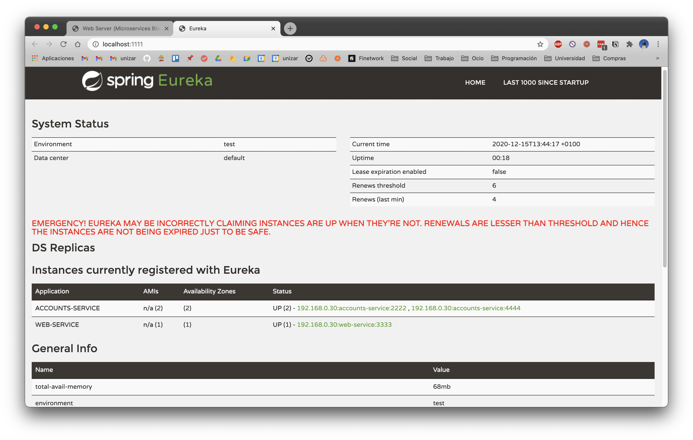

# Report Laboratory 6 - Microservices

**Author: Pedro Allué Tamargo (758267)**

First, we're going to launch 3 processes
(accounts microservices, web frontend and registration service).

When all the processes are ready, we can navigate into `http://localhost:3333`
and select `Eureka Dashboard: http://localhost:1111`. 
We have only launched 1 accounts service so as we can see in the following image
there's only one `accounts-service`.

Now, we are going to add new `accounts-service` in the same machine
but in port 4444. So we need to add new gradle module called `accounts2` and 
then edit `accounts2/src/main/resources/application.yml` to change port
to 4444. The modified file should be like:

Now, we run `gradle :accounts2:bootRun` and we look again to 
_Eureka Dashboard_.

We can see that now there are 2 `accounts-service` services. 
First service is located at `192.168.0.30:2222` and second one is 
at `192.168.0.30:4444` (`accounts2` module).
Now this services can reply to client (`web`) requests indistinctly
due to client load balancer in `web/src/main/java/config/WebServerConfiguration.java`.
So, if we make a petition to `accounts-service` service, only one of the services will
return reply.

Now, let's kill `accounts` service (which is located at port `2222`). We can see that
_Eureka Dashboard_ has been updated and now it only shows that there's one `accounts-service` service.

If we try to make a petition (`http://localhost:3333/accounts/owner/Keri`) over `accounts-service` service,
we receive a reply from `accounts2`. Execution log of `accounts2` shows `Hibernate SQL sentence` caused by
invocation of `byOwner()` method.

There were no errors caused by killing `accounts` service due to existence of another service which can reply
`web` requests and load balancer component. This component balances load at client side, so it needs to query _Eureka_ 
to know which is the _IP_ of the `accounts-service` service.